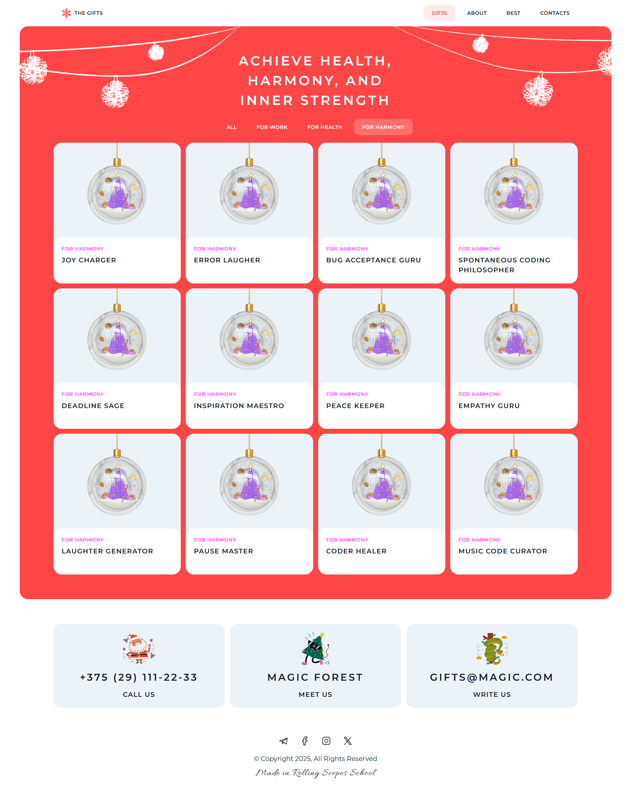

# Christmas Shop project

This is a simple responsive landing page built with HTML, CSS, and JavaScript.
It represents a fictional Christmas shop and includes the following sections:
- 🎁 Gifts
- ℹ️ About
- 🌟 Best Sellers
- 📞 Contacts

The design follows a Figma template provided by [**RS School**](https://rs.school/).

## 🖼️ Deploy
[Christmas Shop project](https://silvermockingjay.github.io/my-projects/christmas-shop/)

## 🖼️ Preview

## ✨ Features

- Dynamic product card generation from data
- Filtering of product cards
- Modal window for product details
- Live countdown timer to the New Year
- Carousel with new year wishes
- Page navigation
- Burger menu for mobile devices
- "Back to Top" button on the Gifts page (mobile only)
- Reponsive design

## 🛠️ Technologies Used

- HTML5
- CSS3
- JavaScript

## 📦 Installation

Clone the repo and open `index.html` in your browser.
