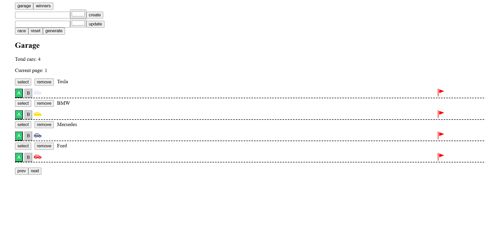
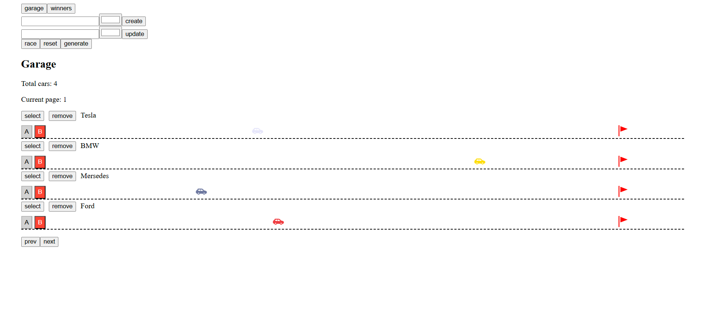
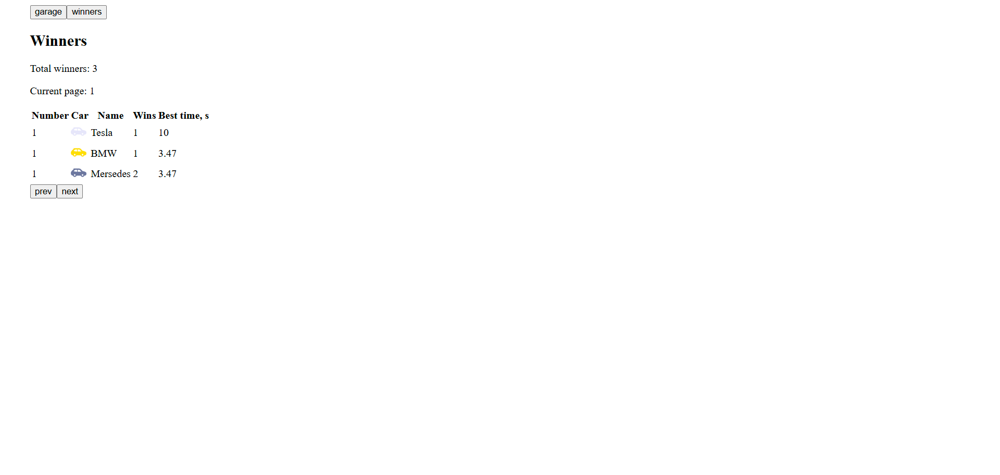

# Async Race project
SPA to manage the collection of cars, operate their engines, and show race statistics

## 🖼️ Deploy
[Async Race project](https://silvermockingjay.github.io/my-projects/async-race/)

## 🖼️ Preview




## ✨ Features

- Modular architecture with clean separation of concerns  
- Dynamic content generation for interactive UI  
- Full CRUD operations for cars using a mock server  
- Designed UI components for car management and race controls  
- Two distinct views: Garage and Winners statistics  
- Animations for car movements and race effects using JavaScript and CSS  
- Server communication using `fetch` with proper promise handling  
- Improved code quality adhering to consistent code style and best practices
- Responsive design

## 🛠️ Technologies Used
- TypeScript
- HTML5
- CSS3
- Webpack
- HTML Webpack Plugin to inject HTML templates
- Style Loader and CSS Loader for handling styles
- ESLint with:
  - Airbnb base config
  - TypeScript and import plugins
  - Prettier integration
- Prettier for automatic code formatting

## ⚙️ Available Scripts

- `npm run build`  
  Builds the project using **Webpack** and outputs the bundled files.

- `npm start`  
  Starts the development server with **Webpack Dev Server** and opens the app in your browser.

- `npm run lint`  
  Runs **ESLint** to check your code for style and quality issues.

- `npm run format`  
  Formats your code files (`.ts`, `.js`, `.json`, `.css`) using **Prettier**.

- `npm run ci:format`  
  Checks if your code files are properly formatted with **Prettier** without making changes.

## 📦 Installation
1. **Clone the repository:**

```bash
git clone https://github.com/silvermockingjay/my-projects.git
cd my-projects
git checkout async-race
```

2. **Install dependencies:**

```bash
npm install
```

3. **Set up and run the backend server:**

This project requires a backend server provided by [RS School](https://rs.school/).

You can find the server repository here: [async-race-api](https://github.com/mikhama/async-race-api).

Follow the instructions in that repo to clone, set up, and run the server locally.

4. **Start the development server:**

```bash
npm start
```
This will open the app in your browser.