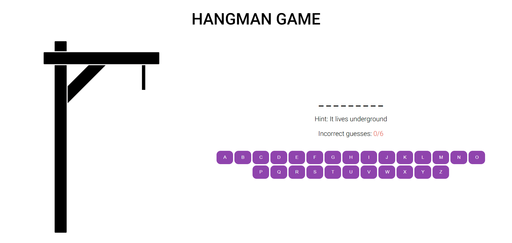
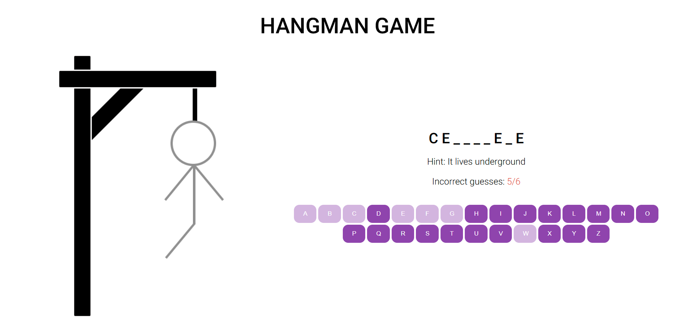
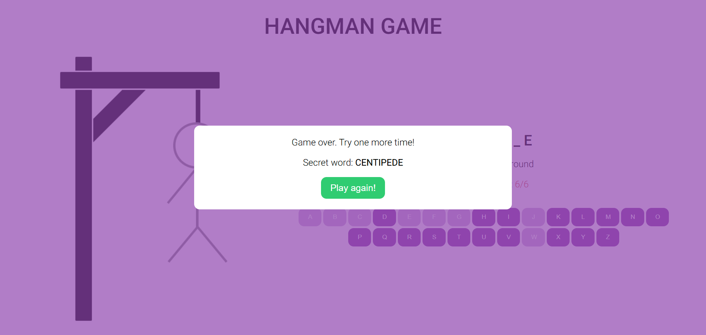
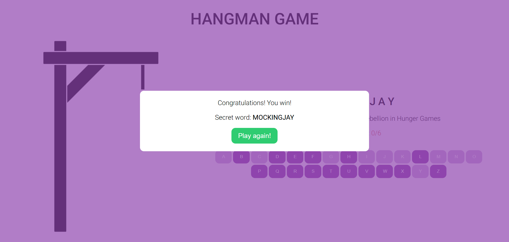

# Hangman game project
A classic word game in which you must find the correct answer by guessing letters one at a time.

Design is inspired by the [Figma template](https://www.figma.com/design/ug2NAUiXPpaFDvch5TWUxd/Hangman-game?node-id=0-1&p=f&t=jr20IBrTCXtf8C5q-0) provided by [**RS School**](https://rs.school/).

The game flow follows [RS School task](https://github.com/rolling-scopes-school/js-fe-course-en/blob/main/tasks/hangman/hangman.md).

## 🖼️ Deploy
[Hangman game project](https://silvermockingjay.github.io/my-projects/hangman/)

## 🖼️ Preview

## ✨ Features

- Random question–answer generation for each game round
- Visual gallows with hangman parts appearing on wrong guesses
- Playable via both virtual and physical keyboard input
- Modal window showing game outcome (win/lose)
- Dynamic DOM updates during gameplay
- Responsive page layout for desktop and mobile devices
- All elements generated dynamically with JavaScript

## 🛠️ Technologies Used
- HTML5
- CSS3
- JavaScript

## 📦 Installation
Clone the repo and open index.html in your browser.
